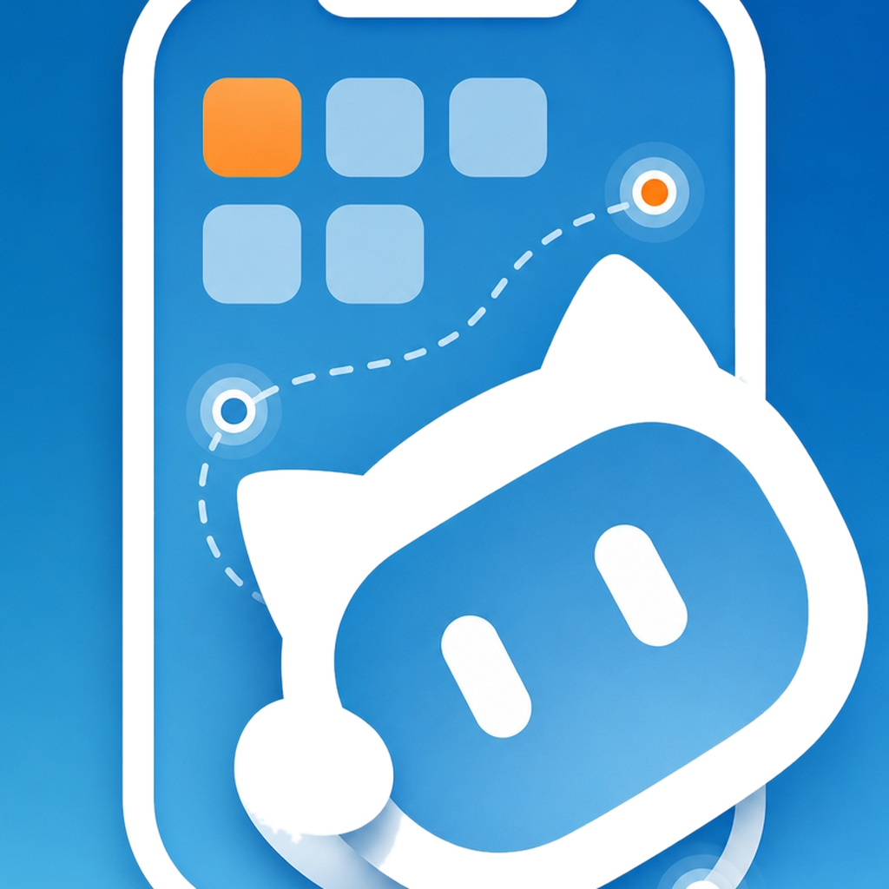
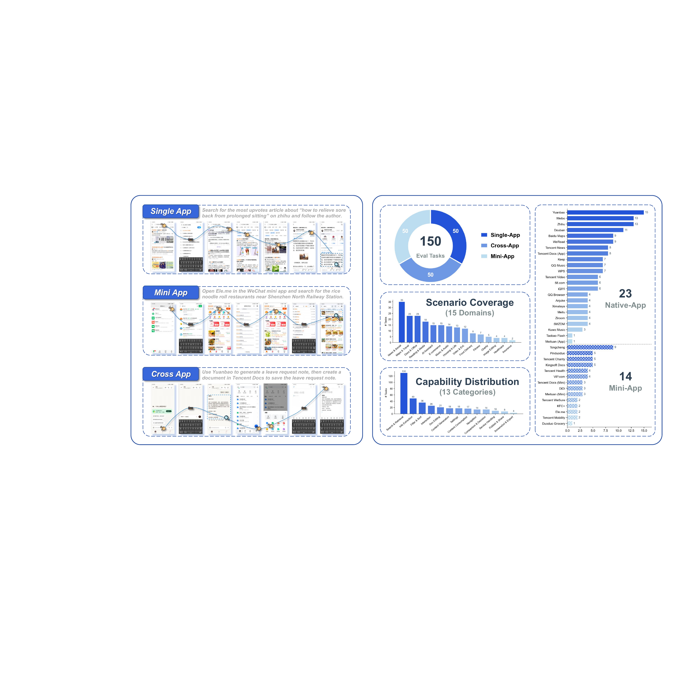
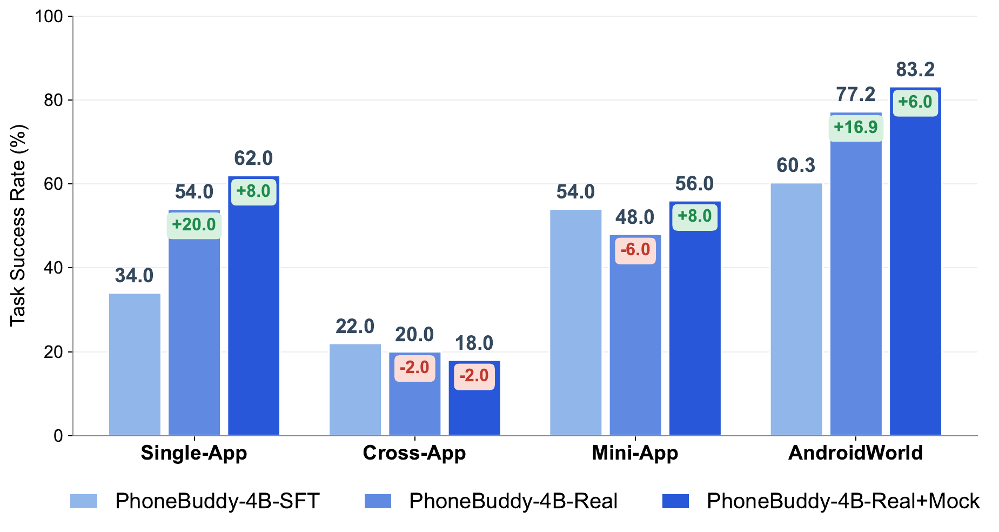

<div align="center">



# PhoneBuddy

### Training Open Phone-Use Agents with Real-App and Mock-App RL

<p>
   <a href="https://phonebuddyai.github.io/"><b>PhoneBuddy</b></a> &nbsp;•&nbsp;
  🌍 <a href="https://arxiv.org/abs/2605.29486"><b>PhoneWorld</b></a> &nbsp;•&nbsp;
  🛠️ <a href="https://phoneharness.github.io/"><b>PhoneHarness</b></a> &nbsp;•&nbsp;
  🔐 <a href="https://arxiv.org/abs/2604.00986"><b>PhonePrivacy</b></a> &nbsp;•&nbsp;
  🛡️ <a href="https://arxiv.org/abs/2605.07630"><b>PhoneSafety</b></a>
</p>

<p>
  <a href="https://phonebuddyai.github.io/"></a>
  <a href="https://arxiv.org/abs/2606.23049"></a>
  <a href="https://huggingface.co/PhoneBuddyAI/PhoneBuddy-4B"></a>
</p>

<p>
  <b>PhoneBuddy</b> trains open phone-use agents that learn from both real phone execution and scalable PhoneWorld-style mock-app environments.
  The core result: <b>real-app RL gives realism; mock-app RL gives resettable, verifiable interaction scale.</b>
</p>

<p>
  🧠 Open phone-use models &nbsp;•&nbsp; 📲 real-phone evaluation &nbsp;•&nbsp; 🧪 mock-app RL &nbsp;•&nbsp; ✅ verifier-backed tasks
</p>

</div>

---

## 🚨 News

- **2026-06-26**: 📄 arXiv preprint is live: [arXiv:2606.23049](https://arxiv.org/abs/2606.23049).
- **2026-06-15**: 🤗 PhoneBuddy models are public on Hugging Face: [PhoneBuddy-4B](https://huggingface.co/PhoneBuddyAI/PhoneBuddy-4B), [PhoneBuddy-4B-RealApp](https://huggingface.co/PhoneBuddyAI/PhoneBuddy-4B-RealApp), and [PhoneBuddy-0.8B](https://huggingface.co/PhoneBuddyAI/PhoneBuddy-0.8B).
- **2026-06-12**: 🌐 Project page launched: [phonebuddyai.github.io](https://phonebuddyai.github.io/).
- **2026-06-11**: 📄 Paper snapshot and result figures added to the project page.
- **2026-06-10**: 🧭 The project page now connects the five-work phone-agent research line listed above.

---

## ✨ What Is PhoneBuddy?

Most mobile agents are evaluated as GUI controllers: observe a screen, tap, type, swipe, repeat. PhoneBuddy studies a training recipe for open phone-use models that can improve under real execution feedback while also benefiting from scalable mock-app supervision.

PhoneBuddy compares a shared SFT checkpoint, real-app RL, and mixed real+mock RL. The mixed recipe uses PhoneWorld-style mock apps as resettable environments with automatic verifiers, then evaluates whether this scalable signal transfers back to real-phone tasks and AndroidWorld.

---

## 🤗 Model Zoo

| Model | Status | Training Recipe | Notes |
| --- | --- | --- | --- |
| **PhoneBuddy-4B** | [HF Model](https://huggingface.co/PhoneBuddyAI/PhoneBuddy-4B) | Real+Mock RL | Main checkpoint used for the headline release. |
| **PhoneBuddy-4B-RealApp** | [HF Model](https://huggingface.co/PhoneBuddyAI/PhoneBuddy-4B-RealApp) | Real-only RL | Ablation checkpoint without mock-app RL. |
| **PhoneBuddy-0.8B** | [HF Model](https://huggingface.co/PhoneBuddyAI/PhoneBuddy-0.8B) | Real+Mock RL | Smaller checkpoint for lightweight experiments. |

The public model release follows the Qwen-style XML tool-call format defined in the model `chat_template.jinja`. Dataset artifacts are not planned for public release at this stage.

---

## 📊 Results Snapshot

| Model | Single-App | Cross-App | WeChat Mini-App | AndroidWorld | Avg. |
| --- | ---: | ---: | ---: | ---: | ---: |
| PhoneBuddy-4B-SFT | 34.0 | 22.0 | 54.0 | 60.3 | 42.6 |
| PhoneBuddy-4B-Real | 54.0 | 20.0 | 48.0 | 77.2 | 49.8 |
| **PhoneBuddy-4B-Real+Mock** | **62.0** | 18.0 | **56.0** | **83.2** | **54.8** |

**Takeaway.** Real-app RL substantially improves over SFT. Adding mock-app RL further improves the average result, with the strongest gains on single-app tasks and AndroidWorld.

<p align="center">
  
</p>
<p align="center">
  
</p>

---

## 🧭 Phone-Agent Research Gallery

PhoneBuddy is one piece of a larger phone-agent stack: environments, training, runtime, privacy, and safety.

| Tag | Project | Links | Role |
| --- | --- | --- | --- |
| **[Training]** |  **PhoneBuddy** | [Project](https://phonebuddyai.github.io/) · [Paper](https://arxiv.org/abs/2606.23049) · [Code](https://github.com/PhoneBuddyAI/phonebuddy) · [4B](https://huggingface.co/PhoneBuddyAI/PhoneBuddy-4B) · [4B-RealApp](https://huggingface.co/PhoneBuddyAI/PhoneBuddy-4B-RealApp) · [0.8B](https://huggingface.co/PhoneBuddyAI/PhoneBuddy-0.8B) | Trains open phone-use models with real-app RL and mock-app RL. |
| **[Environment]** | 🌍 **PhoneWorld** | [Paper](https://arxiv.org/abs/2605.29486) · [中文 Blog](https://mp.weixin.qq.com/s/uzasS6q6LAwX8wLXD7KzeA) | Converts real GUI trajectories into scalable phone-use environments, tasks, verifiers, and rollouts. |
| **[Runtime]** | 🛠️ **PhoneHarness** | [Project](https://phoneharness.github.io/) · [Paper](https://arxiv.org/abs/2606.14832) · [Code](https://github.com/PhoneHarness/phoneharness) · [Dataset](https://huggingface.co/datasets/PhoneHarness/phoneharness-bench) · [中文 Blog](https://mp.weixin.qq.com/s/I2ztL6sFiHGxAiCfh_FTqg?scene=1) | Mixed-action phone-agent harness and benchmark across CLI, GUI, and MCP tools with trace-backed verification. |
| **[Privacy]** | 🔐 **PhonePrivacy** | [Paper](https://arxiv.org/abs/2604.00986) · [中文 Blog](https://mp.weixin.qq.com/s/0uqLRepCABA7ptOAPXjDZA) | Verifiable privacy benchmark for phone-use agents. |
| **[Safety]** | 🛡️ **PhoneSafety** | [Paper](https://arxiv.org/abs/2605.07630) · [Code](https://github.com/tangzhy/PhoneSafety) | Safety evaluation for phone-use agents, separating safety from incapability. |

---

## 🗂️ Repository Layout

```text
phonebuddy/
├── assets/
│   ├── figures/      # Paper and project figures
│   └── paper.pdf     # Current paper snapshot
├── docs/             # Public documentation drafts
└── README.md
```

---

## 📌 Release Plan

- ✅ Project page and paper snapshot
- 🚧 PhoneBuddy-4B model release
- 🚧 Lightweight and ablation checkpoints
- 🚧 Code release and evaluation documentation
- ❌ No public dataset release planned at this stage

---

## 📚 Citation

```bibtex
@misc{tang2026phonebuddytrainingopenmodels,
      title={PhoneBuddy: Training Open Models for Agentic Phone Use},
      author={Zhengyang Tang and Xin Lai and Pengyuan Lyu and Xinyuan Wang and Tianyi Bai and Chenxin Li and Yiduo Guo and Huawen Shen and Yuxuan Liu and Junyi Li and Zhengyao Fang and Yang Ding and Yi Zhang and Weinong Wang and Xingran Zhou and Liang Wu and Fei Tang and Sunqi Fan and Shangpin Peng and Zheng Ruan and Anran Zhang and Benyou Wang and Ji-Rong Wen and Rui Yan and Chengquan Zhang and Han Hu},
      year={2026},
      eprint={2606.23049},
      archivePrefix={arXiv},
      primaryClass={cs.CL},
      url={https://arxiv.org/abs/2606.23049},
}
```

---

<div align="center">

Made for open phone-use agents. Follow updates at [phonebuddyai.github.io](https://phonebuddyai.github.io/).

</div>
